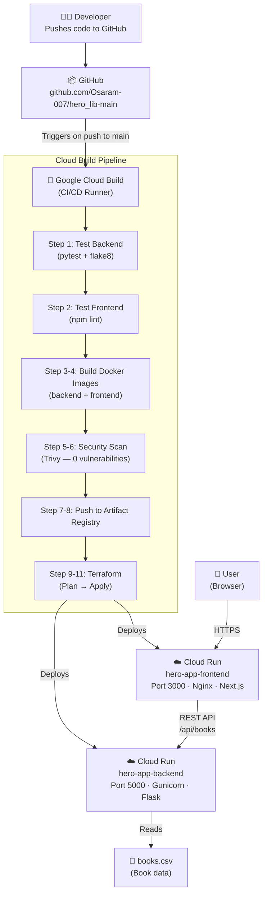

# 📚 Hero Lib — Full Project Documentation

> A book catalogue web application with a Python backend API and a Next.js frontend, deployed on Google Cloud Run via a fully automated CI/CD pipeline.

---

## 🗺️ Table of Contents

1. [Project Overview](#1-project-overview)
2. [Live URLs](#2-live-urls)
3. [Architecture Diagram](#3-architecture-diagram)
4. [Technology Stack — Full Detail](#4-technology-stack--full-detail)
5. [File Structure Explained](#5-file-structure-explained)
6. [CI/CD Pipeline — Step by Step](#6-cicd-pipeline--step-by-step)
7. [Terraform Infrastructure — What It Manages](#7-terraform-infrastructure--what-it-manages)
8. [Security Design](#8-security-design)
9. [How Data Flows — End to End](#9-how-data-flows--end-to-end)
10. [🎓 Explain Like I'm in 10th Grade](#10--explain-like-im-in-10th-grade)

---

## 1. Project Overview

**Hero Lib** is a web application that lets users browse a catalogue of books. It is split into two independent services:

| Service | Language | What it does |
|---|---|---|
| **Backend** (`hero-app-backend`) | Python (Flask) | Reads book data from a CSV file and exposes it as a REST API |
| **Frontend** (`hero-app-frontend`) | Next.js (React/TypeScript) | Displays the book data in a nice UI, fetched from the backend API |

Both services run independently on **Google Cloud Run** — Google's serverless container platform — meaning they scale automatically and you only pay when traffic comes in.

---

## 2. Live URLs

| Service | URL |
|---|---|
| 🌐 **Frontend** | https://hero-app-frontend-uno3fs2ruq-uc.a.run.app |
| 🔌 **Backend API** | https://hero-app-backend-uno3fs2ruq-uc.a.run.app |
| 📖 **Books API endpoint** | https://hero-app-backend-uno3fs2ruq-uc.a.run.app/api/books |
| ❤️ **Health check** | https://hero-app-backend-uno3fs2ruq-uc.a.run.app/api/health |

---

## 3. Architecture Diagram



---

## 4. Technology Stack — Full Detail

### 🐍 Backend: Python + Flask

| Tool | Version | Role |
|---|---|---|
| **Python** | 3.11 | Programming language for the backend |
| **Flask** | 3.1.3 | Lightweight web framework — creates the API server |
| **Flask-CORS** | 6.0.2 | Allows the frontend (different URL) to talk to the backend |
| **Pandas** | 3.0.1 | Data manipulation library — reads and processes the CSV file |
| **NumPy** | 2.4.3 | Math/array library (dependency of Pandas) |
| **Gunicorn** | 25.1.0 | Production-grade WSGI server — serves Flask in production |

**Key file:** [hero_lib/app.py](file:///c:/Users/athar/OneDrive/Documents/GitHub/hero_lib-main/hero_lib/app.py)
- Exposes `/api/books` — returns paginated book data as JSON
- Exposes `/api/health` — health check endpoint
- Reads `books_data/books.csv` using Pandas

---

### ⚛️ Frontend: Next.js + TypeScript

| Tool | Version | Role |
|---|---|---|
| **Next.js** | 14.2.0 | React framework — builds server-side and static web pages |
| **React** | 18.3.1 | UI component library |
| **TypeScript** | 5.9.3 | Typed JavaScript — catches bugs at build time |
| **TailwindCSS** | 3.4.1 | Utility-first CSS framework for styling |
| **ESLint** | 8.57.0 | Code linting tool — enforces consistent code style |
| **Nginx** | alpine | Web server — serves the built static Next.js app |

**Key file:** `new UI/components/books-table.tsx`
- Fetches book data from `NEXT_PUBLIC_API_URL` (the backend Cloud Run URL)
- Renders the data in an interactive table

---

### 🐳 Docker

| File | Purpose |
|---|---|
| **[Dockerfile.backend](file:///c:/Users/athar/OneDrive/Documents/GitHub/hero_lib-main/Dockerfile.backend)** | Builds the Python Flask container image |
| **[Dockerfile.frontend](file:///c:/Users/athar/OneDrive/Documents/GitHub/hero_lib-main/Dockerfile.frontend)** | Multi-stage build: (1) Build Next.js static site, (2) Serve with Nginx |

**Multi-stage build explained:**
```
Stage 1 (builder): node:18-alpine → runs npm build → generates /app/out/
Stage 2 (server):  nginx:alpine   → serves /app/out/ on port 3000
```

This keeps the final image small — only Nginx and the HTML/JS files, no Node.js runtime needed in production.

---

### ☁️ Google Cloud Platform (GCP)

| Service | What it's used for |
|---|---|
| **Cloud Build** | Runs the CI/CD pipeline when code is pushed |
| **Artifact Registry** | Stores Docker images (`hero-app-repo`) |
| **Cloud Run** | Hosts both services as serverless containers |
| **Secret Manager** | Securely stores the `APP_SECRET` environment variable |
| **Cloud Storage (GCS)** | Stores Terraform state file remotely |
| **Cloud Monitoring** | Uptime checks on the frontend, alerts if it goes down |
| **IAM** | Controls who/what can access each GCP service |

---

### 🏗️ Terraform

| File | Purpose |
|---|---|
| [terraform/main.tf](file:///c:/Users/athar/OneDrive/Documents/GitHub/hero_lib-main/terraform/main.tf) | Defines all GCP resources |
| [terraform/variables.tf](file:///c:/Users/athar/OneDrive/Documents/GitHub/hero_lib-main/terraform/variables.tf) | Input variables (project ID, region, image names) |
| [terraform/outputs.tf](file:///c:/Users/athar/OneDrive/Documents/GitHub/hero_lib-main/terraform/outputs.tf) | Outputs URLs after deployment |

**Resources managed:**
- 8 GCP APIs enabled programmatically
- Artifact Registry repository
- Secret Manager secret + version
- Two service accounts (Cloud Build SA, Cloud Run SA)
- Two Cloud Run services (frontend + backend)
- IAM policies (public access = `allUsers` on both services)
- Uptime check + alert policy on Cloud Monitoring

---

### 🔁 CI/CD: Google Cloud Build

File: [cloudbuild.yaml](file:///c:/Users/athar/OneDrive/Documents/GitHub/hero_lib-main/cloudbuild.yaml) — 11 steps that run every time you push to `main`:

| Step | Tool | What happens |
|---|---|---|
| 1 `test-backend` | `python:3.11-slim` | Install deps, run flake8 lint, run pytest |
| 2 `test-frontend` | `node:18-alpine` | Install deps, run ESLint |
| 3 `build-backend` | Docker | Build backend image tagged with commit SHA |
| 4 `build-frontend` | Docker | Build frontend image (injects backend API URL at build time) |
| 5 `scan-backend` | Trivy | Scan for CRITICAL CVEs — fails build if found |
| 6 `scan-frontend` | Trivy | Same for frontend image |
| 7 `push-backend` | Docker | Push image to Artifact Registry |
| 8 `push-frontend` | Docker | Push image to Artifact Registry |
| 9 `terraform-init` | Terraform | Initialise backend (reads state from GCS) |
| 9.5 `terraform-state-cleanup` | Terraform | Removes stale resources from state |
| 10 `terraform-plan` | Terraform | Shows what will change |
| 11 `terraform-apply` | Terraform | Deploys changes (only on `main` branch) |

---

### 🔐 Security Tools

| Tool | What it does |
|---|---|
| **Trivy** (by Aqua Security) | Scans Docker images for known CVEs (security vulnerabilities). Fails the build if CRITICAL ones are found. |
| **GCP Secret Manager** | `APP_SECRET` is never hardcoded. It's stored in GCP and injected at runtime. |
| **Service Accounts** | Cloud Run runs as a least-privilege service account, not as the root GCP project owner. |
| **IAM Policies** | Both services are explicitly made public using `roles/run.invoker` for `allUsers`. Everything else is locked. |

---

## 5. File Structure Explained

```
hero_lib-main/
│
├── hero_lib/               ← Python backend package
│   ├── __init__.py         ← Makes it a Python package
│   └── app.py              ← Flask routes: /api/books, /api/health
│
├── books_data/
│   └── books.csv           ← Book dataset (50 records, semicolon-delimited)
│
├── tests/
│   └── test_app.py         ← Pytest unit tests for the Flask API
│
├── new UI/                 ← Next.js frontend project
│   ├── components/
│   │   └── books-table.tsx ← Main UI: fetches + displays books
│   ├── package.json        ← Node.js dependency manifest
│   └── next.config.js      ← Next.js configuration (static export)
│
├── terraform/              ← Infrastructure as Code
│   ├── main.tf             ← All GCP resources
│   ├── variables.tf        ← Input variables
│   └── outputs.tf          ← Output values (URLs)
│
├── Dockerfile.backend      ← Docker image recipe for Flask app
├── Dockerfile.frontend     ← Docker image recipe for Next.js + Nginx
├── cloudbuild.yaml         ← CI/CD pipeline definition (11 steps)
├── requirements.txt        ← Python package list
└── .gitignore              ← Files excluded from Git
```

---

## 6. CI/CD Pipeline — Step by Step

> **CI/CD** = Continuous Integration / Continuous Deployment

Every time a developer runs `git push origin main`:

1. GitHub notifies Google Cloud Build via a webhook
2. Cloud Build pulls the latest code
3. It runs all 11 steps in order
4. If any critical step fails, the deployment is stopped
5. If everything passes, new Docker images are deployed to Cloud Run automatically

This means **zero manual deployment steps** — pushing code IS deploying.

---

## 7. Terraform Infrastructure — What It Manages

Terraform is the single source of truth for all GCP infrastructure. Instead of clicking around in the GCP console, everything is defined in code.

```
terraform plan  → shows what will change (like a preview)
terraform apply → makes the changes (creates/updates/destroys resources)
```

The Terraform state (which tracks "what currently exists") is stored in a **GCS bucket** so all team members and the CI/CD pipeline share the same state.

---

## 8. Security Design

```
Internet
   │
   ▼
Cloud Run (hero-app-frontend)  ← Public HTTPS, Nginx serves static files
   │
   │ API calls to backend URL
   ▼
Cloud Run (hero-app-backend)   ← Public HTTPS, Gunicorn serves Flask API
   │
   │ reads from Secret Manager
   ▼
Secret Manager (APP_SECRET)    ← Only accessible by hero-app-cloudrun-sa
```

- **No secrets in code** — all secrets live in GCP Secret Manager
- **No root access** — services run as named service accounts
- **Vulnerability scanning** — every image is checked by Trivy before it touches production
- **CORS** enabled so the frontend can talk to the backend across different domains

---

## 9. How Data Flows — End to End

1. User opens **https://hero-app-frontend-uno3fs2ruq-uc.a.run.app** in browser
2. Nginx serves the pre-built static HTML/JS/CSS files
3. The browser runs the JavaScript, which calls [fetch(NEXT_PUBLIC_API_URL + '/api/books')](file:///c:/Users/athar/OneDrive/Documents/GitHub/hero_lib-main/new%20UI/components/books-table.tsx#24-42)
4. That request hits **https://hero-app-backend-uno3fs2ruq-uc.a.run.app/api/books**
5. Flask reads `books_data/books.csv` using Pandas
6. It returns a JSON response with paginated book data
7. The frontend renders the data in a table

---

## 10. 🎓 Explain Like I'm in 10th Grade

> Every technical concept explained simply!

---

### 🏠 What is this project?
Imagine you want to build a website that shows a list of books — like a digital library catalogue. This project does exactly that. It has two parts:
- A **chef** (the backend) who prepares the book data
- A **waiter** (the frontend) who shows it to you nicely

---

### 🐍 Flask (Python backend)
Think of Flask like a **restaurant kitchen**. When someone asks "give me a list of books", Flask goes to the recipe book (the CSV file), picks the right books, and sends them back as a response.

---

### ⚛️ Next.js (Frontend)
This is the **dining hall** — the part the user actually sees. It asks the kitchen (Flask) for data and puts it beautifully on the table (your browser screen).

---

### 🐳 Docker
Imagine Docker as a **lunchbox**. Instead of saying "install Python, then install Flask, then configure everything...", you pack your entire app into a lunchbox. Anyone can open that lunchbox anywhere and it just works — same on your laptop, same on Google's servers.

---

### ☁️ Cloud Run
This is like **renting a table at a restaurant** instead of owning the whole restaurant. Google manages the building, electricity, and staff. You just bring your food (Docker image) and Google puts it on the table. If 1000 people visit at the same time, Google automatically adds more tables.

---

### 🔁 CI/CD (Cloud Build)
This is your **automatic factory line**. Imagine:
1. You draw a new book cover design (write code)
2. You put it on the conveyor belt (git push)
3. Quality check: Is the design good? (run tests)
4. Safety check: Is there anything dangerous? (Trivy scan)
5. Pack it into a box (Docker build)
6. Ship it to the store (deploy to Cloud Run)

You don't have to do steps 2–6 manually — the factory does it automatically!

---

### 🏗️ Terraform
Imagine you want to build a LEGO city. Instead of building it by hand piece by piece, you write a recipe:
> "Build 2 houses, 1 library, and 1 park"

Terraform is that recipe for your cloud infrastructure. If you run it again, it only changes what's different — it won't knock down the whole city just to rebuild it.

---

### 🔐 Secret Manager
Never write your passwords in your notebook that everyone can read. Instead, lock it in a safe (Secret Manager). Your app has the key to the safe and retrieves the password only when it needs it.

---

### 🛡️ Trivy (Security Scanner)
Like a **metal detector at an airport**. Before your Docker image "boards the flight" to Cloud Run, Trivy checks it for dangerous items (security vulnerabilities). If it finds something dangerous (CRITICAL CVE), it rejects the image and the build fails.

---

### 📄 CSV File
A CSV (Comma-Separated Values) file is just a **super simple spreadsheet**. Each row is a book, each column is a property (title, author, year, etc.). Python's Pandas library reads it like Excel, but in code.

---

### 🔌 REST API
An API (Application Programming Interface) is like a **waiter taking orders**. 
- You say: `GET /api/books?page=1`
- The waiter goes to the kitchen and comes back with: `{"data": [{book1}, {book2}, ...]}`
It's a standard way for different programs (like our frontend and backend) to talk to each other over the internet.

---

### 🌐 CORS (Cross-Origin Resource Sharing)
Imagine two different countries. A citizen of Country A (the frontend at one URL) wants to order food from Country B (the backend at a different URL). By default, browsers block this for security. CORS is like a **visa** — the backend says "I allow requests from the frontend's country".

---

### 📊 GitHub
This is the **Google Docs for code**. Multiple people can work on the same code, track every change ever made, go back in history ("undo" 3 months ago!), and trigger the factory line (CI/CD) automatically when changes are saved.

---

### 🧪 Testing (pytest / ESLint)
- **pytest** is like a **spell checker for logic** — it checks "does the `/api/books` route actually return books?"
- **ESLint** is like a **grammar checker for code** — it says "your variable is unused" or "this line is too long"

Both run automatically before every deployment. If tests fail, the deployment stops.

---

*Documentation generated on: 2026-03-16*
*Project: hero_lib | Repository: Osaram-007/hero_lib-main*
